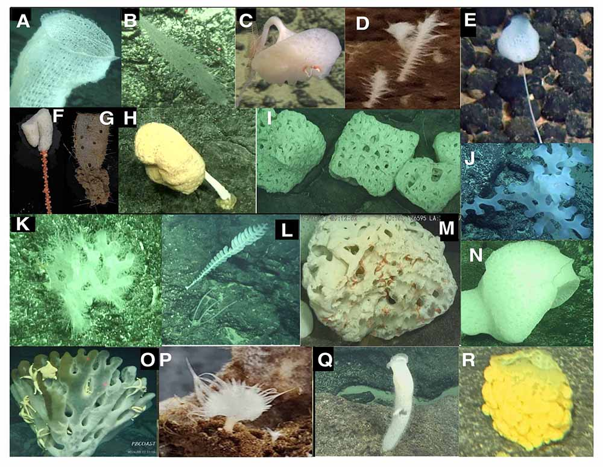
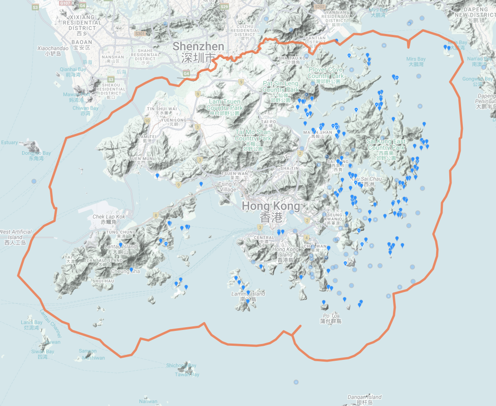
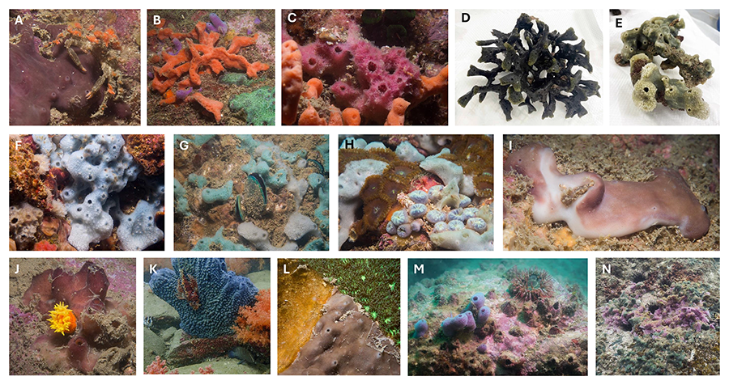

# The origin and evolution of symbiosis between archaea and (possibly) the most primitive animals
Marine sponges (phylum Porifera) have existed for more than 500 million years, making them one of the most primitive extant animals. 
Many sponges host dense and diverse microorganisms and form stable and highly specific relationships with them. 
Sponges’ unique phylogenetic position makes them ideal models for the study of animal-microbe symbiosis that could reveal a wide variety of symbiotic strategies and the core features of all extant symbiosis. Marine sponges are frequently reported to be associated with ammonia-oxidizing archaea and archaeal communities in deep-sea sponges have been found to be orders of magnitude higher than in shallow-water sponges. 
More importantly, specific archaeal lineages exhibit high degree of host specificity in deep-sea Hexactinellida sponges (hereafter referred to as glass sponges), suggesting a vertical transmission of these symbionts. 

Despite recent findings with marker gene-based microbiome surveys, archaeal genomes associated with glass sponges remain significantly underrepresented, with only nine available in public databases. 
This is likely due to predominant distributions of glass sponges in deep sea and limiting a comprehensive understanding of the origin and evolution of archaeal symbiosis in sponges. 
During a recent cruise to the Northwestern Pacific Ocean, we collected 80 glass sponges, covering at least 18 species, from seamounts at depths ranging from 807 to 5,563 meters. 
These samples serve as valuable resources to significantly reduce the sample bias related to the underrepresented archaeal symbionts associated with glass sponges. 

In this project, we hypothesize 1) the symbiosis between archaea and sponges originated at the very dawn of animal evolution; and 2) the extant symbioses are a result of the co-adaptation and coevolution of the archaeal symbionts and the sponge hosts. 
To test our hypotheses, we will 
1) address sample bias of the underrepresented archaeal symbionts from glass sponges by generating high-quality archaeal genomes from the 80 glass sponge samples; 
1) reconstruct the evolutionary history of archaeal symbionts, estimate their divergence time and co-relate with the divergence of the hosts; 
2) deduce genome content of the symbiont ancestors, reconstruct their metabolic potentials, trace their evolutionary trajectory and investigate their adaptative mechanisms toward host-associated lifestyle. 

Our research will offer comprehensive insights into the origin and evolution of archaeal symbiosis in sponges, highlight the crucial roles of archaea in supporting sponge functionality, and illuminate how this relationships adapt to environmental changes, which could aid in protecting marine ecosystems under climate change.

**Figure 1** Representative sponge samples collected from Seamounts in the Northwestern Pacific Ocean. A) Euplectellidae sponge; B) Nullarbora sponge; C) Bolosominae sponge; D) Glass sponge; E) Farrea sponge; F) Hyalonema sponge; G) Regadrella sponge; H) Giant stalked Caulophacus sponge; I) Sponge in sub-globular shape; J) Glass sponge; K) Sponge with coral; L) Farrea sponge; M) Sponge with ophiuroids living in its cavity; N) Glass sponges in symbiosis with other animals; O) Sponge with a number of sea stars living on it; P) Asbestopluma cf. flabellum sponge; Q) A flower basket sponge; and R) Euplectellidae sponge.

## Development of a Specimen Library and Database for Hong Kong Sponges and Their Associated Microbial Symbionts (an ECF proposal)
Marine sponges (phylum Porifera) are reported to be distributed widely in Hong Kong waters and to exhibit high morphological diversity, highlighting their ecological importance. However, Hong Kong sponges remain poorly documented, leading to the reduced visibility of Hong Kong species in international databases, their absence from large international research initiatives, a lack of baseline data for environmental and ecosystem monitoring, and insufficient public awareness of sponge diversity and their ecological importance.

In this project, we aim to carry out comprehensive biodiversity surveys in Hong Kong waters, building a specimen library and developing a publicly accessible database that integrates geological and environmental metadata, morphological descriptions, digital 3D models, molecule-based taxonomic classifications, and information about the associated symbiotic microorganisms. The database to be generated, combined with the specimen library, will serve as a valuable resource to support scientific research, advance marine conservation, enhance public engagement, and promote public education and awareness of the biodiversity and ecological significance of Hong Kong sponges.

Here is a preliminary single-page website (https://hkspongedb.github.io) to illustrate the diversity, distribution of some sponges we have previously observed across Hong Kong waters.

**Figure 2** Distribution of the 463 reported Porifera observations on iNaturalist across Hong Kong waters (accessed on December 3rd, 2025). 

**Figure 3** Hong Kong sponges (some may need further confirmation) we observed during several dives near Basalt Island (A, B and C), Bluff Island (D and E), Breakers Reef (F, G and H), Hoi Ha Wan (I and J), Ninepin Island (K), Tai Long Wan (L) and Wong Ngai Chau (M and N).
(All photos/samples presented on this website have not yet been published. If you wish to use any of the photos presented here, please contact Dr. Weizhi Song (ocessongwz@ust.hk) for approval.)

## Bioinformatics and Metagenomics

High-throughput sequencing provides a powerful way to study the ‘unexplored’ and uncultured diversity of microbial communities. My research involves the development of new computational algorithms and pipelines 1) for the processing of sequencing data from new sequencing strategy, including PacBio long read sequencing ([**Song** et al., 2019](https://doi.org/10.1016/j.margen.2019.05.002)) and the recently released Nanopore’s adaptive sampling technology; 2) to improve the quality of metagenome-assembled genomes ([**Song** and Thomas, 2017](https://doi.org/10.1093/bioinformatics/btx086); 3) to link MAGs with their often-missing 16S rRNA gene sequences that are commonly used in phylogenetic analysis and environmental surveys ([**Song** et al., 2022](https://doi.org/10.1093/bioinformatics/btac398)).

## Evolution and metabolic interaction of bacteria-sponge symbiosis 

Complex multicellular organisms often host complex communities of microbial symbionts, which are essential for their health and function. Marine sponges are the oldest extant metazoan that sister to all other animals, making them unique models for the study of animal-microbe interactions that could be core features of all extant forms of symbioses. Importantly, many sponges harbour dense and diverse microorganisms that often form stable and specific associations ([Zhang, **Song** et al., 2019](https://doi.org/10.1128/msystems.00288-19)), making them emerging models in the study of metazoan-microbe symbiosis that could reveal a wide spectrum of symbiotic strategies ([Zhang, **Song** et al., 2022](https://microbiomejournal.biomedcentral.com/articles/10.1186/s40168-021-01220-9)). In addition, knowledge of sponge symbiosis will help to better understand the symbiosis of all animals that have critical ecosystem roles in all marine benthic habitats, including coral, mussels and the deep-sea tubeworms.

## Horizontal gene transfer (HGT) and microbial evolution/adaptation

HGT is considered an important driver of microbial evolution and niche adaptation. My research involves the identification of HGTs (Song et al., 2019, Microbiome) in microorganisms from the natural environments, as well as assessment of the role of HGT in the adaptation of microorganisms to different hosts, including marine sponges ([Robbins, **Song** et al., 2021](https://www.nature.com/articles/s41396-020-00876-9)), macroalgae and human. For example, we found that HGTs in the macroalgal biofilms were frequently involved in genes for nutrient transport and degradation, as well as stress responses, which are considered beneficial for bacteria living in this host-associated niche ([**Song** et al., 2021](https://www.nature.com/articles/s41396-020-00815-8)). 
