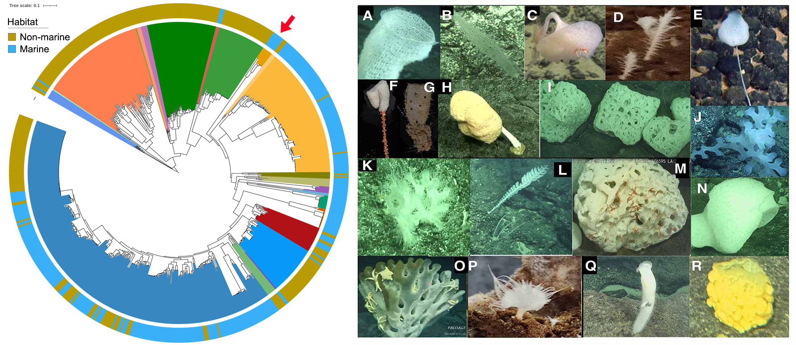
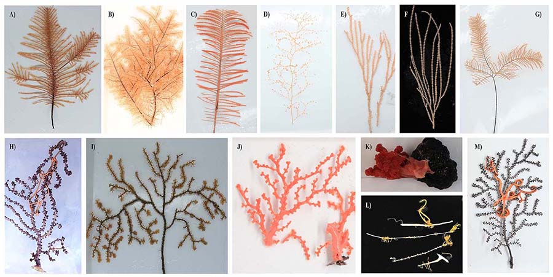
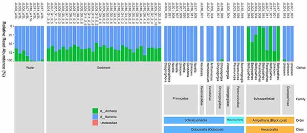
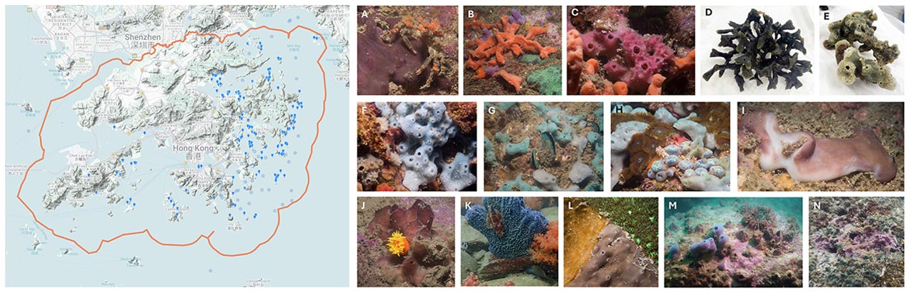

1. [The origin and evolution of symbiosis between archaea and sponges, one of the most primitive animals](https://songweizhi.github.io/research#direction-one-the-origin-and-evolution-of-symbiosis-between-archaea-and-one-of-the-most-primitive-animals-a-rgc-funded-grf-project)
1. [Decoding the functional basis of distinct microbial symbiont associations in deep-sea corals](https://songweizhi.github.io/research#direction-two-decoding-the-functional-basis-of-distinct-microbial-symbiont-associations-in-deep-sea-corals-a-grf-proposal-under-review)
1. [Development of a specimen library and database for Hong Kong sponges and their associated microbial symbionts](https://songweizhi.github.io/research#direction-three-development-of-a-specimen-library-and-database-for-hong-kong-sponges-and-their-associated-microbial-symbionts-an-ecf-proposal-under-review)
1. [Bioinformatics and software development](https://songweizhi.github.io/research#direction-four-bioinformatics-and-software-development-for-more-detail)
1. [Horizontal gene transfer (HGT) and microbial adaptation](https://songweizhi.github.io/research#direction-five-horizontal-gene-transfer-hgt-and-microbial-adaptation)

DIRECTION ONE: The origin and evolution of symbiosis between archaea and sponges ([a RGC funded GRF project](https://cerg1.ugc.edu.hk/cergprod/scrrm00542.jsp?proj_id=16103925&old_proj_id=null&proj_title=&isname=&ioname=weizhi&institution=&subject=&pages=1&year=&theSubmit=16103925))
---

Marine sponges (phylum Porifera) have existed for more than 500 million years, making them one of the most primitive extant animals. 
Many sponges host dense and diverse microorganisms and form stable and highly specific relationships with them ([Zhang, **Song** et al., 2024](https://doi.org/10.1038/s41467-024-55222-w) and [Wang, **Song** et al., 2024](https://doi.org/10.1038/s41467-024-52464-6)). 
Sponges’ unique phylogenetic position makes them ideal models for the study of animal-microbe symbiosis that could reveal a wide variety of symbiotic strategies and the core features of all extant symbiosis. 
Marine sponges are frequently reported to be associated with ammonia-oxidizing archaea (AOA) ([Zhang, **Song** et al., 2019](https://doi.org/10.1128/msystems.00288-19)) and 95.2% of the currently known symbiotic AOA genomes are associated with sponges. Our preliminary analysis revealed that prior to the first symbiosis event between marine sponges and AOA, only four AOA genomes were recovered from marine ecosystems. 
While after the first symbiosis event, 73.9% of AOA originated from marine ecosystems (**Figure 1**), indicating a strong impact of animal-microbe symbiosis on the transition of AOA from terrestrial to marine ecosystems, and thus on global nitrogen cycling during earth history.

Furthermore, archaeal communities in deep-sea sponges are often orders of magnitude more abundant than those in shallow-water sponges. 
Specific archaeal lineages also show a high degree of host specificity in deep-sea Hexactinellida (glass sponges), suggesting vertical transmission of these symbionts. 
However, archaeal genomes associated with glass sponges remain greatly underrepresented, with only nine AOA genomes are currently available in public databases, likely due to predominant distributions of glass sponges in deep sea. During a recent cruise to the Northwestern Pacific Ocean, we collected 80 glass sponges representing at least 18 species from seamounts at depths of 807 to 5,563 meters (**Figure 1**). 
These samples serve as valuable resources to significantly reduce the sample bias related to the underrepresented archaeal symbionts associated with glass sponges.

In this project, we will 
1) address sample bias of the underrepresented archaeal symbionts from glass sponges by generating high-quality archaeal genomes from the 80 glass sponge samples; 
2) reconstruct the evolutionary history of archaeal symbionts, estimate their divergence time and co-relate with the divergence of the sponge hosts; 
3) deduce genome content of the symbiont ancestors, reconstruct their metabolic potentials and trace their evolutionary trajectory;
4) evaluate how the establishment of AOA–sponge symbiosis influenced the transition of AOA from terrestrial to marine environments and, in turn, shaped global nitrogen cycling. 

Our research will offer comprehensive insights into the origin and evolution of archaeal symbiosis in sponges, highlight the crucial roles of archaea in supporting sponge functionality, and illuminate how these relationships adapt to environmental changes, which could aid in protecting marine ecosystems under climate change.

**Figure 1** **Left panel**: The distribution of marine and non-marine AOAs before and after the first symbiosis event between sponges and AOAs (red arrow). **Right panel**: Representative sponge samples collected from Seamounts in the Northwestern Pacific Ocean. A) Euplectellidae sponge; B) Nullarbora sponge; C) Bolosominae sponge; D) Glass sponge; E) Farrea sponge; F) Hyalonema sponge; G) Regadrella sponge; H) Giant stalked Caulophacus sponge; I) Sponge in sub-globular shape; J) Glass sponge; K) Sponge with coral; L) Farrea sponge; M) Sponge with ophiuroids living in its cavity; N) Glass sponges in symbiosis with other animals; O) Sponge with a number of sea stars living on it; P) Asbestopluma cf. flabellum sponge; Q) A flower basket sponge; and R) Euplectellidae sponge.

**Related work**
- Zhang S; **Song W**; Marinos G; Waschina S; Zimmermann J; Kaleta C; Thomas, T, 2024, Genome-scale metabolic modelling reveals interactions and key roles of symbiont clades in a sponge holobiont. Nature Communications, 15(1), 10858. (IF: **14.7**)
- Wang W; **Song W**; Majzoub M; Feng X; Xu B; Tao J ; Fan L, 2024, Decoupling of strain-and intrastrain-level interactions of microbiomes in a sponge holobiont. Nature Communications, 15(1), 8205. (IF: **14.7**)
- Zhang S; **Song W**; Nothiasc L; Couvillion S; Webster N; Thomas T, 2022, 'Comparative metabolomic analysis reveals shared and unique chemical interactions in sponge holobionts', Microbiome, 10, 22. (IF: **16.837**)
- Zhang S; **Song W**; Wemheuer B; Reveillaud J; Webster N; Thomas T, 2019, 'Comparative genomics reveals ecological and evolutionary insights into sponge associated Thaumarchaeota', mSystems, vol. 4. (IF: **7.324**)

DIRECTION TWO: Decoding the functional basis of distinct microbial symbiont associations in deep-sea corals (a GRF proposal, under review)
---

Black corals and octocorals, which exhibit distinct structural properties and may have different nutritional preferences, are abundant in the western Pacific Ocean. Corals often host diverse microbial symbionts that contribute to host growth, resilience and health. While shallow-water corals often rely on their associated photosynthetic zooxanthellae or prosthecochloris for nutrients, the absence of light in deep sea suggests that microbial symbionts play an especially critical role in the survival of deep-sea corals. Previous studies of deep-sea coral microbiomes have mainly focused on a few octocorals, whereas only two black coral species have been examined to date, leaving a significant knowledge gap regarding the overall diversity, abundance and functions of deep-sea coral-associated microbiomes.

To fill this knowledge gap, we collected 50 deep-sea coral specimens (18 of which were black corals) from the western Pacific Ocean at depths ranging from 805 to 5,572 meters. These samples represent ten coral families, three of which have no previously reported microbiomes, including one black coral and two octocoral families. Our preliminary observations based on amplicon sequencing of the 16S rRNA gene revealed distinct microbial associations across coral taxa. Specifically, an overwhelming dominance of ammonia-oxidizing archaea (AOA) was observed exclusively in black corals from the family Schizopathidae, a phenomenon not reported previously. Furthermore, most of the deep-sea corals were dominated by single microbial species with relative read abundance above 50%. By contrast, only a very limited number of microbial taxa have been reported to dominate shallow-water corals. Overall, our findings suggest strong host-mediated selection for specific microbial symbionts, and thus functions, in the deep-sea corals.

In the proposed project, we will combine metagenomics and genome-scale metabolic modelling to investigate the functional basis underlying the frequently observed dominance of single microbial species in deep-sea corals, and particularly the previously unreported dominance of AOA in schizopathid black corals. Genome-scale metabolic models for the symbionts will be reconstructed to simulate metabolic interactions and reveal how the symbionts collectively benefit the hosts. Functional redundancy, which enhances ecosystem resilience by buffering against symbiont loss, will be assessed. Adaptation mechanisms, such as horizontal gene transfer, of the symbionts towards a coral-associated lifestyle will also be investigated.

**Figure 2** Representative coral samples we collected from the western Pacific Ocean seamounts. Black coral samples from the Schizopathidae (A, B, and C) and Cladopathidae (D) families. Octocoral samples from the Chrysogorgiidae (E), Primnoidae (F and G), Victorgorgiidae (H), Paramuriceidae (I), Coralliidae (J and K), Keratoisididae (L), and Plexauridae (M) families.

**Figure 3** Domain level community structure of the microbiomes across coral, seawater and sediment samples (A). NMDS plot showing the similarity of microbial communities among coral families (B) and genera (C). 

**Related work**
- **Song W**, Zhang S, Perez M, Li J, Ma H, Thomas T,  Qiu J, Qian P, 2025, 'Distinct patterns of microbial association across deep-sea corals from the Western Pacific Magellan Seamounts', Microbiology Spectrum, ([https://doi.org/10.1128/spectrum.02093-25](https://doi.org/10.1128/spectrum.02093-25))

DIRECTION THREE: Development of a specimen library and database for Hong Kong sponges and their associated microbial symbionts (an ECF proposal, under review)
---

Marine sponges (phylum Porifera) are found to be distributed widely in Hong Kong waters and to exhibit high morphological diversity ([https://hkspongedb.github.io](https://hkspongedb.github.io)), highlighting their ecological importance. 
However, Hong Kong sponges remain poorly documented, the most recent scientific publication on Hong Kong sponges dating back to 2014, over a decade ago, focusing on the response of sponge-associated bacterial symbionts to copper exposure (Tian et al., 2014). The remaining studies on Hong Kong sponges were conducted even earlier, between 2005 and 2007, primarily investigating their antifouling, anti-bacteria and anti-diatom properties (Dobretsov et al., 2005a; Dobretsov et al., 2005b; Qian et al., 2006; On et al., 2007).
This prolonged neglect has resulted in the reduced visibility of Hong Kong sponges in international biological/biodiversity databases (including [the Sponge Barcoding Project](https://www.spongebarcoding.org), [The Sponge Genetree Server](https://www.spongegenetrees.org/methods.php) and 
[The World Porifera Database](https://www.marinespecies.org/porifera)) and the absence of Hong Kong sponges in large international research initiatives, such as the [Tree of Life - Aquatic Symbiosis Genomics project](https://www.sanger.ac.uk/collaboration/aquatic-symbiosis-genomics-project).

To address the long-standing neglect of Hong Kong sponges and the resulted knowledge gap on their diversity, distribution, abundance and ecology, in this project we propose to carry out comprehensive biodiversity surveys of sponges in Hong Kong waters, building a specimen library, and developing a publicly accessible database that integrates geological and environmental metadata, morphological descriptions, digital 3D models, molecule-based taxonomic classifications and information about the associated symbiotic microorganisms. The database to be generated, along with the specimen library, will serve as a valuable resource to support scientific research, advance marine conservation, enhance public engagement, and promote public education and awareness of the biodiversity and ecological significance of Hong Kong sponges.

In addition, sponges are rich source of natural products, the sponge samples collected in this project will serve as a valuable resource for discovering new natural products, such as those with antibacterial, antiviral, antifungal, and anticancer activities. 
Furthermore, sponges obtain nutrients by filtering vast volumes of seawater, the specimens collected in this project can also be leveraged for environmental DNA analyses, enabling comprehensive assessments of biodiversity across Hong Kong waters.
Here is a single-page website to illustrate the diversity, distribution of some sponges we observed across Hong Kong waters: 

With this project, I aim to establish a leading laboratory for sponge research in Hong Kong by fostering strong collaborations with experts in natural product discovery and environmental DNA studies. These partnerships will enable integrative, multidisciplinary research that advances our understanding of sponges, their symbionts, and their ecological and biotechnological importance.

**Figure 4** On the left is the distribution of the 463 reported Porifera observations on iNaturalist across Hong Kong waters (accessed on December 3rd, 2025). 
on the right are Hong Kong sponges (some may need further confirmation) we observed during several dives near Basalt Island (A, B and C), Bluff Island (D and E), Breakers Reef (F, G and H), Hoi Ha Wan (I and J), Ninepin Island (K), Tai Long Wan (L) and Wong Ngai Chau (M and N).
(All sponge photos presented here are not yet published. If you wish to use any of them, please **contact me for approval**. I would like to thank Mr **Markus Rummel** and Miss **Lucia Hu** (OCES, HKUST) for their great contributions in capturing the stunning photos, collecting the sponge samples, and preparing the ECF proposal)

DIRECTION FOUR: Bioinformatics and Software Development ([for more detail](https://songweizhi.github.io/software))
---

High-throughput sequencing provides a powerful way to study the ‘unexplored’ and uncultured diversity of microbial communities. My research involves the development of new computational algorithms and pipelines 1) for the processing of sequencing data from new sequencing strategy, including PacBio long read sequencing ([**Song** et al., 2019](https://doi.org/10.1016/j.margen.2019.05.002)) and the recently released Nanopore’s adaptive sampling technology; 2) to improve the quality of metagenome-assembled genomes ([**Song** and Thomas, 2017](https://doi.org/10.1093/bioinformatics/btx086)); 3) to link MAGs with their often-missing 16S rRNA gene sequences that are commonly used in phylogenetic analysis and environmental surveys ([**Song** et al., 2022](https://doi.org/10.1093/bioinformatics/btac398)).

**Related work**
- **Song W**, Zhang S, Thomas T, 2022, 'MarkerMAG: linking metagenome-assembled genomes (MAGs) with 16S rRNA marker genes using paired-end short reads', Bioinformatics, btac398. (IF: **6.931**)
- **Song W**; Wemheuer B; Zhang S; Steensen K; Thomas T, 2019, 'MetaCHIP: Community-level horizontal gene transfer identification through the combination of best-match and phylogenetic approaches', Microbiome, vol. 7, pp. 36. (IF: **16.837**)
- **Song W**; Thomas T, 2017, 'Binning-refiner: Improving genome bins through the combination of different binning programs', Bioinformatics, vol. 33, pp. 1873 – 1875. (IF: **6.931**)
- **Song W**; Steensen K; Thomas T, 2017, 'HgtSIM: A simulator for horizontal gene transfer (HGT) in microbial communities', PeerJ, vol. 2017. (IF: 3.061)
- **Song W**; Thomas T; Edwards RJ, 2019, 'Complete genome sequences of pooled genomic DNA from 10 marine bacteria using PacBio long-read sequencing', Marine Genomics, vol. 48. (IF: 2.143)

DIRECTION FIVE: Horizontal Gene Transfer (HGT) and Microbial Adaptation
---

HGT is considered an important driver of microbial evolution and niche adaptation. My research involves the identification of HGTs ([**Song** et al., 2017](https://doi.org/10.7717/peerj.4015) and [**Song** et al., 2019](https://doi.org/10.1186/s40168-019-0649-y)) in microorganisms from the natural environments, as well as assessment of the role of HGT in the adaptation of microorganisms to different hosts, including marine sponges ([Robbins, **Song** et al., 2021](https://www.nature.com/articles/s41396-020-00876-9)), macroalgae and human. For example, we found that HGTs in the macroalgal biofilms were frequently involved in genes for nutrient transport and degradation, as well as stress responses, which are considered beneficial for bacteria living in this host-associated niche ([**Song** et al., 2021](https://www.nature.com/articles/s41396-020-00815-8)). 

**Related work**
- **Song W**; Wemheuer B; Zhang S; Steensen K; Thomas T, 2019, 'MetaCHIP: Community-level horizontal gene transfer identification through the combination of best-match and phylogenetic approaches', Microbiome, vol. 7, pp. 36. (IF: **16.837**)
- **Song W**; Wemheuer B; Steinberg PD; Marzinelli EM; Thomas T, 2021, 'Contribution of horizontal gene transfer to the functionality of microbial biofilm on a macroalgae', ISME Journal, vol. 15, pp. 807 – 817. (IF: **13.214**)
- **Song W**; Steensen K; Thomas T, 2017, 'HgtSIM: A simulator for horizontal gene transfer (HGT) in microbial communities', PeerJ, vol. 2017. (IF: 3.061)
- Robbins SJ; **Song W**; Engelberts JP; Glasl B; Slaby BM; Boyd J; Marangon E; Botté ES; Laffy P; Thomas T; Webster NS, 2021, 'A genomic view of the microbiome of coral reef demosponges', ISME Journal, vol. 15, pp. 1641 – 1654. (IF: **13.214**)
- Dong X; Zhang C; Li W; Weng S; **Song W**; Li J; Wang Y, 2021, 'Functional diversity of microbial communities in inactive seafloor sulfide deposits', FEMS Microbiology Ecology, Aug;97(8): fiab108. (IF: 4.519)
- Li Z, Zhao C, Mao Z, Zhang F, Dong L, Song C, Chen Y, Fu X, Ao Z, Xiong Y, Hui Q, **Song W**, Penttinen P, Zhang S, 2025, 'Structure and metabolic function of spatiotemporal pit mud microbiome. Environmental microbiome', 20;20(1):10.
